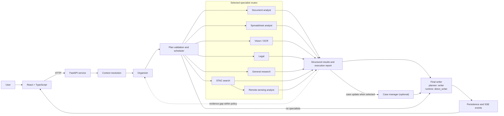

<h1 align="center">AgroCopilot</h1>

<p align="center">
  <strong>A conversational agricultural copilot with multi-agent orchestration, case continuity and traceable evidence.</strong>
</p>

<p align="center">
  
  
  
  
  <a href="LICENSE"></a>
</p>

AgroCopilot turns questions, documents, field observations and satellite signals into operational answers that preserve the context of each case. The user interacts through one interface; the system selects the specialists required, gathers evidence and returns recommendations with sources, uncertainties and suggested next steps.

The project combines a FastAPI backend, a React/Vite frontend, local persistence, server-sent events (SSE) and specialised agents. It is a reproducible demonstration and validation environment, not a replacement for qualified agricultural advice.

This repository accompanies the Master's dissertation *Design and Implementation of an LLM-Powered Multi-Agent Orchestration Framework for Agriculture*. The repository is intended for academic inspection; benchmark claims are scoped to the corpus, model configurations and service conditions described below.

## Capabilities

- **Case-oriented conversations:** preserves explicit cases, open tasks, blockers and observations across interactions.
- **Adaptive orchestration:** activates only the agents required for each question.
- **Attachment analysis:** processes documents, images and spreadsheets through specialised routes.
- **Regulatory evidence:** combines local retrieval, official sources and cautious-response controls.
- **Meteorological context:** adds historical Open-Meteo summaries to compatible remote-sensing analyses.
- **Remote sensing:** queries STAC catalogues and interprets scenes and indices over time.
- **Traceability:** exposes agent activity, references, SSE events and estimated costs.
- **Reproducible evaluation:** includes a fixed corpus, six model configurations, three judge configurations, metrics and result-export tooling.
- **Local mode:** supports product exploration without external calls by setting `DISABLE_EXTERNALS=1`.

## Architecture



The orchestrator resolves context, selects the smallest suitable route and validates its dependency graph. Only the selected specialists run; independent routes may run in parallel, while `stac` must precede `rs_analyst`. The case manager is optional, and a simple query can use the writer fast path without specialists. Structured contracts preserve evidence, limitations and operational state throughout the workflow.

See the [detailed architecture](docs/architecture.md) for component responsibilities, persistence and deployment boundaries.

## Verified repository checks

The release has been validated with:

| Component | Result |
| --- | ---: |
| Python suite on Python 3.11 | `521 passed, 1 skipped` |
| Python suite on Python 3.13 | `521 passed, 1 skipped` |
| Frontend regression test | `1 passed` |
| TypeScript | `tsc --noEmit` passed |
| Production build | Vite build passed |
| Repository hygiene review | No tracked secrets or generated result exports |

The CI workflow runs these checks on pushes and pull requests.

## Quick start

### 1. Requirements

- Python 3.10 or later.
- Node.js 20 or later.
- Git.
- Optional: an OpenAI or OpenRouter API key for LLM-backed workflows.
- Optional: Tesseract for local OCR.

### 2. Prepare the backend

```bash
git clone https://github.com/pablocatret/AgroCopilot.git
cd AgroCopilot

python -m venv .venv
```

Activate the environment:

```bash
# Linux / macOS
source .venv/bin/activate

# Windows PowerShell
.\.venv\Scripts\Activate.ps1
```

Install the project:

```bash
pip install -e ".[dev]"
```

### 3. Configure the environment

```bash
# Linux / macOS
cp .env.example .env

# Windows PowerShell
Copy-Item .env.example .env
```

The example configuration starts in local mode:

```dotenv
DISABLE_EXTERNALS=1
OCR_BACKEND=none
VITE_API_BASE=http://localhost:8000
```

To enable live calls, add the selected provider key and set `DISABLE_EXTERNALS=0`. Never commit or upload the `.env` file.

### 4. Start the application

Backend:

```bash
uvicorn backend.api:app --reload --port 8000
```

Frontend, in a separate terminal:

```bash
cd ui-web
npm ci
npm run dev
```

Open `http://localhost:5173`. The API health check is available at `http://localhost:8000/health`.

### 5. Verify the local application

Open `http://localhost:5173` after starting the backend and frontend. Use `DISABLE_EXTERNALS=1` for an offline inspection; live model, search and satellite results require the configured external providers.

## Essential configuration

| Variable | Purpose | Recommended local value |
| --- | --- | --- |
| `DISABLE_EXTERNALS` | Disables network and LLM calls | `1` |
| `LLM_PROVIDER` | Primary model provider | `openai` |
| `OPENAI_API_KEY` | OpenAI credential | empty locally |
| `OPENROUTER_API_KEY` | OpenRouter credential | empty locally |
| `VITE_API_BASE` | Backend URL used by the UI | `http://localhost:8000` |
| `VECTOR_BACKEND` | Vector persistence backend | `sqlite` |
| `OCR_BACKEND` | OCR engine | `none` |
| `ENABLE_STAC` | Enables satellite search | `true` |
| `COST_TRACKING_ENABLED` | Records estimated costs | `true` |

All options and default models are documented in [.env.example](.env.example).

## Execution flow

1. The frontend sends the question and attachments to `POST /chat`.
2. The backend creates or retrieves the conversation and relevant case context.
3. `organizer` builds a plan using the smallest suitable agent route.
4. Selected specialists produce structured evidence or explain their limitations.
5. When selected by the plan, `case_manager` updates case state, tasks and blockers.
6. The writer produces a cautious, actionable and traceable response.
7. The system persists the result and streams progress through SSE.

### Agents

| Agent | Responsibility |
| --- | --- |
| `organizer` | Route selection, execution policy and replanning |
| `document_analyst` | Document extraction and analysis |
| `spreadsheet_analyst` | CSV and spreadsheet profiling |
| `vision_ocr` | OCR and visual signals |
| `legal` | Regulatory retrieval and source comparison |
| `stac` | Satellite-scene search |
| `rs_analyst` | Interpretation of indices and temporal change |
| `free` | Bounded general research with optional web search |
| `case_manager` | Continuity, tasks, evidence and blockers |
| `direct_writer` | Short answers for questions that need no specialists |
| `writer` | Multi-agent synthesis and final response |

`writer` is the planner-facing name for the final response step. The runtime registry uses `direct_writer` for that implementation in both the fast path and multi-agent synthesis; it is not a second writer instance.

Agent contracts and boundaries are described in [docs/agent_prompt_contracts.md](docs/agent_prompt_contracts.md).

## API

| Method | Route | Purpose |
| --- | --- | --- |
| `GET` | `/health` | Basic service status |
| `GET` | `/version` | API version |
| `POST` | `/chat` | Run a query |
| `GET` | `/events/{conversation_id}` | SSE progress and traces |
| `POST` | `/attachments` | Upload attachments |
| `GET` | `/conversations` | List conversations |
| `GET` | `/cases` | List explicit cases |
| `POST` | `/cases` | Create an explicit case |
| `GET` | `/cases/{case_id}` | Retrieve case state |
| `GET` | `/workspace-context/{workspace_id}` | Retrieve stable context |
| `GET` | `/costs/summary` | Retrieve estimated costs |

See the [complete API reference](docs/api.md) for assertions, tasks, observations, memory and error contracts.

Example:

```bash
curl -X POST http://localhost:8000/chat \
  -H "Content-Type: application/json" \
  -d '{
    "query": "The northern field is showing signs of water stress. What should I inspect today?",
    "conversation_id": "demo-conv-001",
    "user_id": "finca-las-lomas",
    "decision_mode": "case",
    "response_mode": "conversation",
    "continuity_mode": "auto",
    "memory_enabled": false,
    "attachment_ids": []
  }'
```

## Persistence and data

AgroCopilot uses local storage by default:

- `data.db`: default SQLite vector index.
- `data/cases.db`: cases, assertions, tasks, observations and case events.
- `data/costs.db`: estimated costs by conversation and day.
- `data/conversations.db`: conversations and messages.
- `backend/attachments/`: uploaded attachments.
- `backend/logs/`: technical traces when enabled.

These paths are excluded from Git. The repository contains synthetic evaluation fixtures and no production data.

## Evaluation

The evaluation compares six model configurations as alternative model backends for the same AgroCopilot workflow. There is no separate monolithic baseline in the final dissertation experiment. The fixed corpus contains 57 cases (48 seed and 9 adversarial), each model is run once per case at temperature zero, and three LLM judge configurations assess 10 semantic dimensions. This produces 342 system executions and 1,026 judge assessments.

The main outcome is execution-level overall quality after averaging the three judge scores. The protocol also records deterministic completeness and safety measures, routing precision and recall, technical success, parser behaviour, latency and known operational cost. The final statistical analysis uses case bootstrap confidence intervals, Friedman’s global test, paired Wilcoxon tests with Holm correction, paired effect sizes, Wilson intervals, ICC(2,1) and Kendall’s W.

The manuscript reports GPT-5 mini and GPT-5.6 Luna as the leading quality group (4.304 and 4.246 out of 5, with no detected difference), DeepSeek Flash, DeepSeek Pro and GPT-OSS in an unresolved middle group, and Ministral with the lowest mean (3.374). These results describe the evaluated corpus and provider conditions; they are not agronomic or legal validation.

Validation without LLM calls:

```bash
python -m evaluation.cli preflight --config evaluation/configs/benchmark_final.json
```

Controlled execution:

```bash
EVALUATION_ENABLE_LLM=1 \
python -m evaluation.cli compare \
  --config evaluation/configs/benchmark_final.json \
  --output evaluation/results/benchmark_final \
  --max-concurrent 2
```

For the seven-batch dissertation execution on Windows PowerShell, use:

```powershell
.\evaluation\run_benchmark_overnight.ps1
```

After the batch completes, generate descriptive output and the dissertation statistics:

Replace `<batch_id>` with the directory created by `compare` under
`evaluation/results/benchmark_final/`.

```bash
python -m evaluation.cli report \
  --results-dir evaluation/results/benchmark_final/<batch_id> \
  --output evaluation/report/<batch_id>
python evaluation/analyze_benchmark_statistics.py \
  --input evaluation/results/benchmark_final \
  --bootstrap 10000 \
  --seed 20260724
```

Read [evaluation/README.md](evaluation/README.md) before running benchmarks with external providers. It explains budgets, artefacts and interpretative limits.

## Quality checks

Backend and evaluation:

```bash
python -m pytest tests tests_evaluation -q
```

Frontend:

```bash
cd ui-web
npm test
npm run typecheck
npm run build
```

On Windows, if pytest requires an explicit temporary path:

```powershell
python -m pytest tests tests_evaluation -q --basetemp .\.cache\pytest-agrocopilot
```

## Docker

```bash
cp .env.example .env
docker compose up --build
```

Services:

- Frontend: `http://localhost:5173`
- Backend: `http://localhost:8000`
- Health check: `http://localhost:8000/health`

The supplied `docker-compose.yml` targets local development. A multi-user deployment requires authentication, external secret management, shared storage and a durable event broker.

## Repository structure

```text
agents/                 specialised agents
backend/                API, orchestration, SSE and persistence
docs/                   architecture and technical guides
evaluation/             corpus, runners, metrics and reports
libs/                   contracts, RAG, STAC and utilities
prompts/                versioned prompts by agent
scripts/                ingestion and migrations
tests/                  agent, API and service tests
tests_evaluation/       evaluation-framework tests
ui-web/                 React/Vite frontend
```

## Documentation

- [Documentation index](docs/README.md): scope, source-of-truth map and reading paths.
- [Architecture](docs/architecture.md): components, workflow and deployment boundaries.
- [API reference](docs/api.md): routes, request contracts, SSE and errors.
- [Configuration](docs/configuration.md): supported settings, local profiles and external services.
- [Agent contracts](docs/agent_prompt_contracts.md): responsibilities and guardrails.
- [Prompting and context](docs/prompting.md): instruction composition and validation.
- [Runtime notes](docs/multi-agent-runtime-notes.md): technical decisions and compatibility.
- [Evaluation](evaluation/README.md): protocol, commands and artefacts.
- [Responsible use](DISCLAIMER.md): scope and limitations of recommendations.

## Scope and limitations

- Outputs may contain errors and should be reviewed before decisions are made.
- Satellite evidence supports hypotheses; it cannot establish an agronomic cause by itself.
- Regulatory information should be checked against current official sources.
- Costs are estimates based on the configured catalogue.
- The supplied SSE runtime targets local development and single-process deployments.
- The project does not include production-ready multi-user authentication.

## Citation

If AgroCopilot supports your research, assessment or software, please cite it as:

> Catret-Ruber, P. (2026). *AgroCopilot: A traceable multi-agent agricultural copilot* (Version 0.1.0) [Computer software]. GitHub. https://github.com/pablocatret/AgroCopilot

BibTeX:

```bibtex
@software{catret_ruber_2026_agrocopilot,
  author  = {Catret-Ruber, Pablo},
  title   = {AgroCopilot: A Traceable Multi-Agent Agricultural Copilot},
  year    = {2026},
  version = {0.1.0},
  url     = {https://github.com/pablocatret/AgroCopilot},
  note    = {Computer software}
}
```

GitHub reads [CITATION.cff](CITATION.cff) to populate **Cite this repository**.

## Author

**Pablo Catret-Ruber**

## Licence

AgroCopilot is distributed under the MIT Licence. See [LICENSE](LICENSE).

The software is provided as a technical demonstration and decision-support tool. Users remain responsible for checking sources, protecting their data and obtaining professional advice where appropriate. See [DISCLAIMER.md](DISCLAIMER.md).
