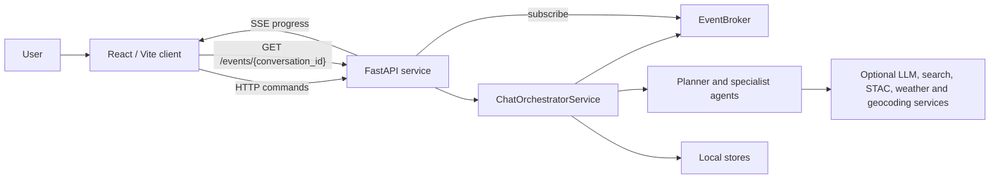

# AgroCopilot architecture

The browser client, HTTP API, orchestrator, specialist agents and local stores are separate components. The runtime maps each agricultural query to an agent plan and returns one traceable answer.

## System context



The browser reaches the event broker through FastAPI; it does not access the broker directly. The orchestrator publishes lifecycle events and the API exposes them as an SSE stream.

External providers are optional at configuration level. Setting `DISABLE_EXTERNALS=1` prevents network and model calls and is the supported profile for tests and local inspection.

## Runtime components

### Web client

`ui-web/` provides:

- conversation entry and attachment upload;
- agent-run progress;
- structured answers and references;
- remote-sensing panels;
- case selection, assertions, tasks and observations;
- conversation history; and
- estimated cost information.

The client uses HTTP for commands and stored data. It subscribes to `GET /events/{conversation_id}` for progress events while a chat execution is active.

### HTTP API

`backend/api.py` is the public service boundary. It:

- validates request bodies with Pydantic;
- checks that referenced attachments exist before orchestration;
- exposes chat, case, assertion, task, observation, memory, conversation and cost endpoints;
- creates an `EventSourceResponse` for SSE; and
- maps missing resources and invalid state transitions to HTTP errors.

The complete route inventory is in [api.md](api.md).

### Orchestrator

`backend/services/chat_orchestrator.py` coordinates a chat execution. It does not itself perform specialist analysis. Its responsibilities include:

1. assigning or recovering the conversation identifier;
2. loading conversation history and any explicitly enabled memory;
3. resolving case continuity and reusable remote-sensing context;
4. asking `organizer` for a typed `AgentPlan`;
5. returning a clarification request when the plan is intentionally empty;
6. executing the dependency graph with bounded concurrency;
7. recording usable, partial and failed agent results;
8. applying at most the configured bounded replan;
9. updating case state where relevant;
10. invoking the direct or multi-agent writer;
11. persisting the conversation and cost data; and
12. publishing lifecycle events.

### Agents

The runtime registry is created by `_cached_agents()` in `backend/api.py`. It contains:

- `organizer`
- `legal`
- `case_manager`
- `stac`
- `rs_analyst`
- `free`
- `direct_writer`
- `document_analyst`
- `spreadsheet_analyst`
- `vision_ocr`

`writer` is the planner-facing response-step name and is not a separate registry entry. At runtime, the registered `direct_writer` implementation handles both the single-agent fast path and the final multi-agent synthesis contract. Agent responsibilities and boundaries are documented in [agent_prompt_contracts.md](agent_prompt_contracts.md).

## Request lifecycle

```mermaid
sequenceDiagram
    participant UI as Web client
    participant API as FastAPI
    participant O as Orchestrator
    participant P as Organizer
    participant A as Specialists
    participant C as Case manager
    participant W as Final writer (planner: writer; runtime: direct_writer)
    participant DB as Local stores
    participant EB as Event broker

    UI->>API: GET /events/{conversation_id}
    API->>EB: Subscribe to conversation events
    UI->>API: POST /chat
    API->>API: Validate attachments and request
    API->>O: Execute query
    O->>DB: Load conversation, case and optional memory
    O->>P: Build typed plan
    alt Clarification required
        P-->>O: Empty plan + clarification
        O-->>API: Clarification response
    else Executable plan
        P-->>O: Steps, missions and dependencies
        O->>O: Validate plan and release dependency-ready work
        O->>A: Run ready specialists
        A-->>O: Structured results and limitations
        opt Evidence gap and replan allowed
            O->>P: Replan with execution state
            P-->>O: Additional bounded steps or stop
        end
        opt Case update selected by the plan
            O->>C: Reduce evidence into case state
            C-->>O: State, tasks and blockers
        end
        O->>W: Evidence bundle and execution report
        W-->>O: FinalAnswer
        O->>DB: Persist answer and case/conversation state
        O->>EB: Publish lifecycle events
        O-->>API: AgentPlan + FinalAnswer
    end
    EB-->>API: Progress events
    API-->>UI: SSE progress
    API-->>UI: ChatResponse
```

The scheduler is application-owned and is represented by the orchestrator self-call: it validates dependencies, releases ready steps and applies any bounded replan before the final writer runs.

Independent agents are eligible to run concurrently only when their declared dependencies are satisfied. `AGENT_CONCURRENCY_LIMIT` bounds this parallelism.

## Evidence flow

Specialists return Pydantic models derived from `BaseAgentOutput`. The orchestrator classifies each run as usable, partial or failed and builds an execution report. The writer receives:

- specialist outputs;
- references;
- attachment metadata;
- case and conversation context;
- temporal comparisons;
- explicit limitations and partial failures; and
- the effective plan policy.

The structured bundle prevents the final response from depending on concatenated agent prose. `FinalAnswer` keeps narrative Markdown alongside machine-readable fields such as `references`, `limitations`, `next_actions`, `case_state`, `evidence_ledger` and `cost_summary`.

## Continuity and data ownership

There are two related persistence models:

1. **Explicit cases** are authoritative for case records, assertions, tasks, observations and events. They are stored by `backend/case_store.py`.
2. **Opt-in memory** stores user-editable profile and farm context plus legacy Markdown/JSON mirrors. It is handled by `backend/memory_store.py` and is disabled by default in `ChatRequest`.

The models coexist for migration and compatibility. Documentation and integrations should not describe the Markdown memory mirror as the authoritative explicit-case store.

## Local persistence

| Data | Default location | Implementation |
| --- | --- | --- |
| Cases, assertions, tasks and observations | `data/cases.db` | SQLite |
| Conversations and messages | `data/conversations.db` | SQLite |
| Cost events | `data/costs.db` | SQLite |
| Uploaded attachments and metadata | `backend/attachments/` | Files plus SQLite metadata |
| Opt-in memory | `backend/memory/` | Markdown and structured JSON |
| Default vector index | path derived from `DATABASE_URL` | SQLite |
| Qdrant local index | `qdrant_data/` | Optional embedded Qdrant |
| SSE replay | `backend/logs/conversations/` | Optional JSONL when `SSE_LOG_MODE=disk` |

Generated runtime data is excluded from Git.

## Reliability boundaries

The implementation includes:

- strict request and response models;
- strict JSON-schema conversion for supported model calls;
- deterministic fallbacks for planning and case-state reduction;
- bounded concurrency, retry policy and replanning;
- attachment count, size and type checks;
- partial-failure reporting;
- atomic writes for memory files; and
- repeatable Python and frontend CI.

It does not include:

- authentication or authorisation;
- tenant isolation;
- encrypted secrets or data at rest;
- distributed locks;
- shared attachment storage;
- a multi-worker-safe event stream;
- automatic database migrations for a managed production database;
- backups, retention automation or disaster recovery; or
- production monitoring and alerting.

## Deployment model

The supplied `docker-compose.yml` and local commands run one API process and one Vite development server. The API uses process-local objects and local files, so horizontally scaling it without replacing those boundaries would lead to inconsistent event delivery and storage access.

A production design would need, at minimum, an identity layer, a managed relational database, object storage, a shared queue or stream, a secrets manager, provider egress controls, observability, backups and a reviewed retention policy.

## Extending the system

To add or materially change an agent:

1. define or update its Pydantic contract in `libs/schemas.py`;
2. implement the agent under `agents/`;
3. register it in `backend/api.py` and, if planner-selectable, `agents/organizer.py`;
4. add its prompt templates under `prompts/`;
5. declare dependencies and routing constraints;
6. add unit, routing and orchestration tests;
7. add representative evaluation cases; and
8. update [agent_prompt_contracts.md](agent_prompt_contracts.md) and [prompting.md](prompting.md).
